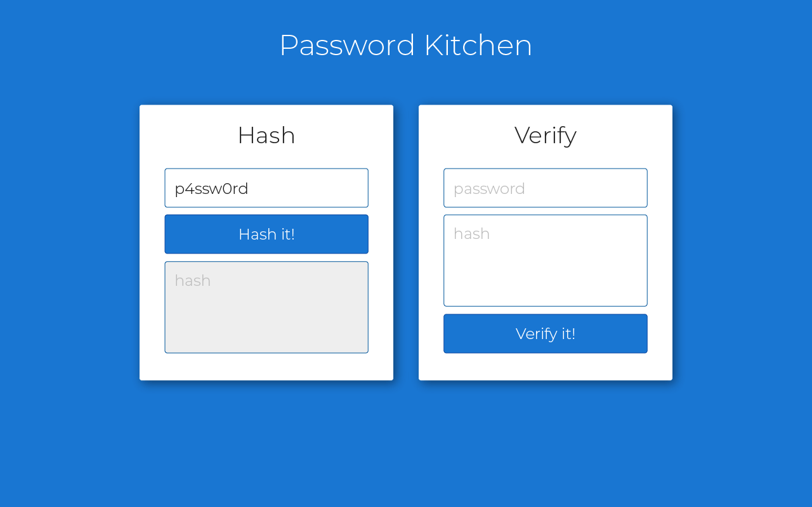
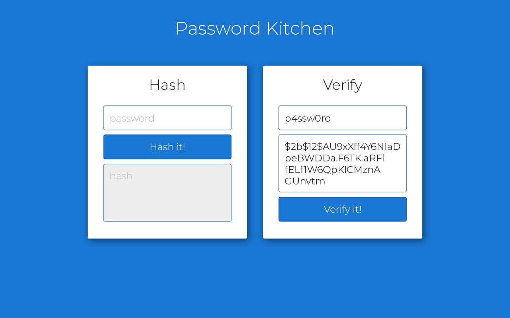
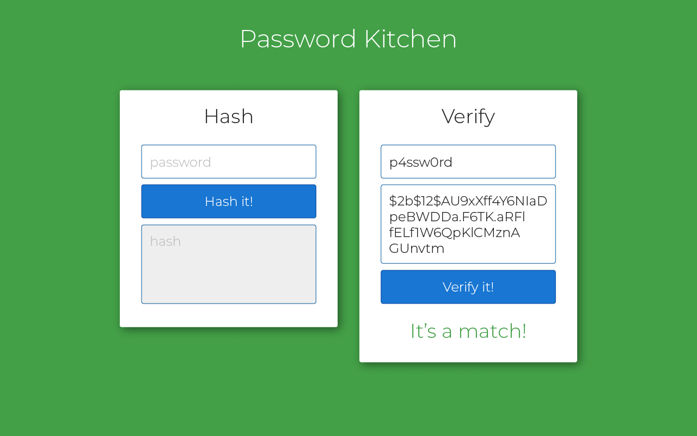
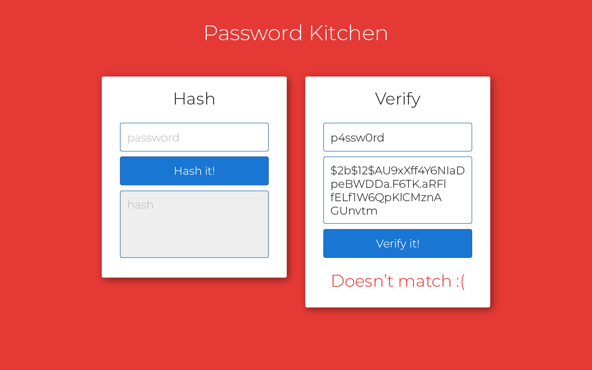

# Password Kitchen

## Intro

This is a small project to hash passwords and verify hashed passwords.

## Design

The designer sent us the following plans:

### Hashing - User input

### Hashing - Result hash

### Verification - User input

### Verification - Match

### Verification - Doesn't match

### Details

Use the following info to achieve the desired result:
- Colors:
  - Background:
    - Default:  #1976d2
    - Verified:  #43a047
    - Failed verification:  #e53935
  - Text:
    - Page header:  #fff
    - Card header:  #222
  - Inputs:
    - Background:  #fff
    - Border color:  #01579b
    - Text color:  #222
    - Inactive textarea:  #eee
  - Buttons:
    - Background:  #1976d2
    - Border color:  #01579b
    - Text color:  #fff
- Font:
  - The light *(300)* version of **Montserrat** font family is used in the whole application
  - It can be linked from Google's font repository
- Background:
  - It should cover the whole page
  - When the verification succeeds, the background should change to green.
  - When the verification fails, the background should change to red.
- Cards:
  - They are 400px wide and have 40px gap between them.
  - For the shadow, you can use this snippet: `box-shadow: 0 1px 5px rgba(0, 0, 0, .9)`
  - There is 40px space inside between the edge of the card and the start of the inputs and buttons
  - They have 4px border radius
- Inputs:
  - Every input has 4px border radius
  - The hash result textarea has an inactive property
